# Belltown Parking Occupancy Prediction: A Machine Learning Approach to Urban Parking Intelligence

**Yimei Liang, Junhan Chen, Xihe Wang**

## 1. Introduction

Urban parking scarcity is one of the most persistent and costly challenges in modern cities. In Seattle's Belltown neighborhood — a dense, mixed-use district adjacent to downtown — drivers frequently circle blocks searching for available street parking, contributing to traffic congestion, increased emissions, and driver frustration. Studies by INRIX estimate that American drivers spend an average of 17 hours per year searching for parking, at a combined annual cost of roughly $345 per driver. In high-demand urban cores like Belltown, this figure is considerably higher.

The City of Seattle operates a paid on-street parking system managed by the Seattle Department of Transportation (SDOT), which records real-time occupancy data from thousands of blockface sensors across the city. This dataset, openly published on the Seattle Open Data portal, provides a unique opportunity to apply machine learning techniques to a problem with direct civic impact: predicting how full a given parking block will be at a given time.

This project addresses the following problem: **Given a target parking block, day of week, hour of day, month, and weather conditions, can we accurately predict the occupancy rate of that block?** A reliable prediction system would allow drivers to plan parking in advance, reduce search-related cruising, and inform city planners about peak demand patterns.

Our approach follows the complete machine learning pipeline: data acquisition and cleaning, feature engineering, model training and evaluation, and deployment as an interactive web application. The final product is a five-tab Streamlit application providing occupancy predictions, exploratory data visualizations, model performance dashboards, and an interactive map with batch predictions for all Belltown blocks.

Three regression models were trained and compared: **XGBoost**, **Random Forest**, and **Linear Regression**, with hourly occupancy rate (a continuous value from 0 to 1) as the prediction target. The best-performing model, Random Forest, achieves strong performance on a 20% internal holdout, demonstrating that temporal, spatial, and meteorological features together provide meaningful predictive signal for parking demand.

## 2. Dataset and Exploratory Analysis

### 2.1 Data Source

The dataset originates from the **Seattle Paid Parking Occupancy** dataset, published by SDOT and available through the Seattle Open Data portal. It records minute-level parking transactions across all paid blockfaces in Seattle. Each raw record captures the following fields:

| Column | Description |
|---|---|
| OccupancyDateTime | Timestamp of the observation |
| PaidOccupancy | Number of occupied paid spaces |
| ParkingSpaceCount | Total paid spaces on the blockface |
| PaidParkingRate | Hourly parking rate in USD |
| BlockfaceName | Unique city block segment identifier |
| SideOfStreet | Which side of the street (N/S/E/W) |
| ParkingTimeLimitCategory | Maximum allowed parking duration |
| PaidParkingArea | Neighborhood-level area name |
| PaidParkingSubArea | Sub-area within the neighborhood |
| ParkingCategory | Category (commercial, residential, etc.) |
| Location | WKT point geometry POINT(lon lat) |

For this project we focus exclusively on the **Belltown** sub-area to ensure geographic coherence. Training data consists of the full calendar year 2023 (`belltown_2023_full.csv`), while test data is a recent 30-day snapshot collected in 2026 (`belltown_last30days.csv`). The 3-year gap between these two sets deliberately introduces temporal distribution shift, providing a stringent test of model generalizability.

### 2.2 Dataset Characteristics

Raw occupancy rate is computed as:

> occ_rate = PaidOccupancy / ParkingSpaceCount, clipped to [0, 1]

After hourly aggregation across all Belltown blockfaces and filtering to business hours (8:00–19:00), the dataset spans roughly 150+ unique blockfaces. The target variable is binned into three qualitative categories: **Low** (< 0.40), **Medium** (0.40–0.70), and **High** (> 0.70).

### 2.3 Exploratory Data Analysis

EDA revealed several structural patterns that directly informed feature engineering.

**Intraday temporal pattern.** Occupancy follows a bimodal daily shape: it rises from its morning baseline to a lunch peak (11:00–13:00), dips slightly in the mid-afternoon, and spikes again during the evening commute (17:00–19:00). This motivated the creation of `is_lunch` and `is_evening` binary indicators.

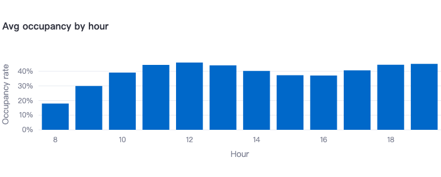
*Figure 1: Average occupancy rate by hour of day. The bimodal structure with a lunch peak (11–12h) and evening peak (18–19h) is clearly visible.*

**Day-of-week variation.** Weekdays carry substantially higher average occupancy than weekends, driven by commuter and daytime worker demand. Friday afternoons stand out as a distinct demand spike consistent with pre-weekend dining and entertainment activity. Importantly, Seattle paid parking is **free on Sundays**, so Sunday data is absent from the dataset entirely — a systematic gap that must be treated explicitly in model encoding.

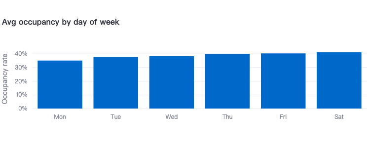
*Figure 2: Average occupancy rate by day of week (Mon–Sat). Sunday is excluded as paid parking is free on Sundays in Seattle.*

**Spatial heterogeneity.** Even within the relatively compact Belltown neighborhood, occupancy varies greatly across blockfaces. Blocks near high foot-traffic commercial corridors consistently outperform residential side streets, with the top 10 highest-demand blocks forming a recognizable spatial cluster.

**Weather effects.** Precipitation exhibits a mild positive correlation with occupancy — likely reflecting drivers who choose to drive (and therefore park) on rainy days rather than walk. Temperature shows a weak negative correlation. These effects are secondary to temporal and spatial patterns but measurable.

**Holiday effects.** US and Washington State public holidays suppress weekday-style occupancy as office workers are absent. Holiday eves show elevated Friday-like patterns as workers leave early.

**Data quality anomalies.** Several dates showed implausibly low average daily occupancy (< 1%), indicating sensor outages rather than genuine low demand. These were identified and removed during preprocessing.

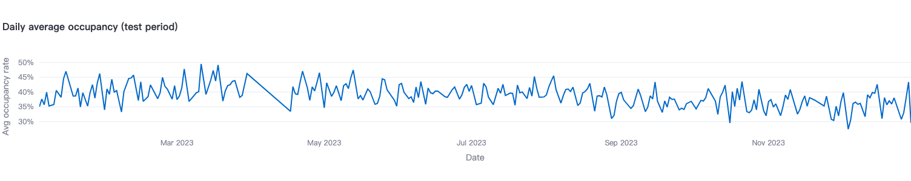
*Figure 3: Daily average occupancy rate across all Belltown blockfaces (Jan–Dec 2023). Weekly periodicity and a summer dip are visible.*

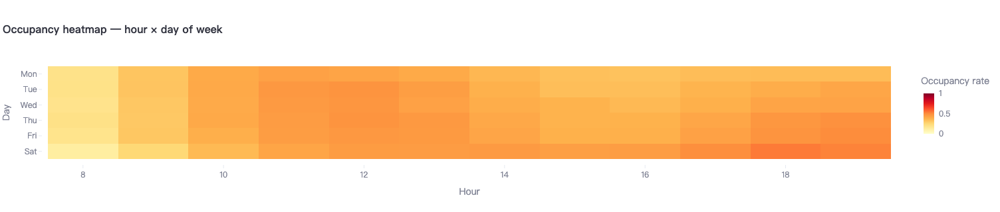
*Figure 4: Heatmap of average occupancy by hour and day of week. Darker orange-red cells indicate higher demand. Late weekday afternoons (Thu–Fri, 17–19h) and midday periods show the highest occupancy.*

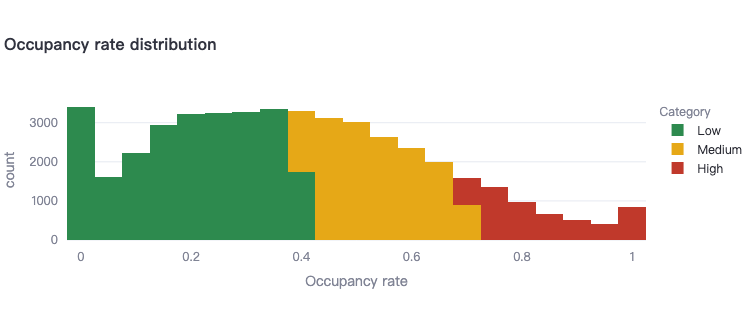
*Figure 5: Distribution of hourly occupancy rates colored by category (Low / Medium / High). The distribution is skewed right with a large Low-occupancy mass and a secondary High-occupancy peak.*

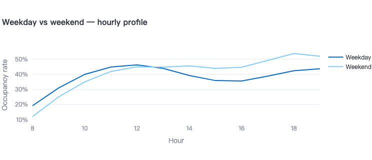
*Figure 6: Average hourly occupancy profile for weekdays vs weekends. Weekdays show a sharper midday peak; weekends show a flatter, later-shifted curve with higher evening demand.*

## 3. Data Preprocessing

The preprocessing pipeline is implemented in `data_loader.py` and proceeds in ten well-defined steps, each motivated by specific observations from EDA. The table below summarizes how the dataset size evolves through the pipeline:

| Stage | Records | Notes |
|---|---|---|
| Raw CSV (minute-level) | ~5M+ | Sub-hourly sensor readings, 142 blockfaces |
| After hourly aggregation | ~620,000 | One record per (block, date, hour) |
| After business hours filter (8–19h) | ~310,000 | 12-hour enforcement window retained |
| After anomalous date removal | ~290,000 | Sensor dropout dates excluded |
| After stratified sampling (50k/month cap) | ~460,900 | Final training set used for modeling |

The final training set covers **142 unique blockfaces** across the full year 2023.

### 3.1 Chunked CSV Reading

The raw CSV files can reach several hundred megabytes, so they are read in chunks of 500,000 rows using `pd.read_csv(..., chunksize=500_000)` to avoid memory overflow. Each chunk is parsed and bucketed by calendar month for downstream month-stratified processing.

### 3.2 Column Renaming and Datetime Parsing

A mapping dictionary standardizes the verbose SDOT column names to concise internal identifiers (e.g., `OccupancyDateTime` → `datetime`, `PaidOccupancy` → `occupied`). The datetime field is parsed with `format="mixed"` to handle any formatting inconsistencies in the raw data.

### 3.3 Hourly Aggregation

Individual sensor readings are aggregated to hourly granularity per blockface:

> occ_rate(block, date, hour) = mean(occupied / capacity) over that hour

This reduces noise, produces a stable interpretable target, and aligns all blockfaces to the same temporal resolution. Records with zero or negative capacity are excluded.

### 3.4 Business Hours Filtering

Only hours 8–19 (inclusive) are retained, corresponding to Seattle's paid parking enforcement window. Outside these hours, no paid occupancy data is collected, and the prediction use case does not apply.

### 3.5 Anomalous Date Removal

Dates where the cross-blockface average daily occupancy falls below 1% are identified as sensor dropout events and removed. Retaining them would teach the model a false association between certain calendar dates and near-zero occupancy.

### 3.6 Historical Mean Feature Engineering

Three blockface-level historical mean features are computed from the **complete aggregated dataset** (before any sampling) to ensure statistical stability:

- **blockface_mean**: Overall average occupancy for each blockface across the full year.
- **blockface_hour_mean**: Average occupancy for each (blockface, hour) pair — the typical hourly demand profile specific to each block.
- **blockface_dow_mean**: Average occupancy for each (blockface, day-of-week) pair — the typical day-of-week profile per block.

These three features turn out to be the most predictive in the final model, because they encode the "base rate" for a specific location at a specific time. Computing them from the full data (rather than from the sampled training set) is a deliberate design choice to avoid underestimation from small samples in rare time slots.

### 3.7 Stratified Sampling

To keep training size computationally manageable, stratified sampling is applied with a cap of 50,000 records per calendar month. Stratification is defined across 35 strata: 7 day-of-week levels × 5 time slots (Early Morning, Morning Peak, Midday, Evening Peak, Night). This preserves proportional representation of all demand regimes and prevents over-sampling of high-frequency midday records.

### 3.8 Cyclical Time Encoding

Raw integer hour and day-of-week values have a discontinuity at their boundaries (hour 23 and hour 0 are adjacent but numerically distant). We apply sine/cosine transformations to encode continuous circular time:

> hour_sin = sin(2π × hour / 24),   hour_cos = cos(2π × hour / 24)

> dow_sin = sin(2π × dow / 7),   dow_cos = cos(2π × dow / 7)

These four features allow models to respect the circular topology of time without hardcoded distance assumptions.

### 3.9 Holiday Flags

Using the `holidays` Python library with Washington State configuration, two binary flags are constructed:

- **is_holiday**: 1 if the date is a US federal or WA state holiday.
- **is_holiday_eve**: 1 if the date is the day immediately preceding a holiday, capturing the elevated pre-holiday occupancy behavior observed in EDA.

### 3.10 Weather Integration

Hourly historical weather data for the Seattle area is retrieved from the **Open-Meteo Archive API** (free, no API key required). Two continuous features are merged to the dataset by (date, hour):

- **temp_c**: Air temperature in Celsius.
- **precip_mm**: Precipitation in millimeters.

A derived binary feature **is_rainy** = 1 if precip_mm > 0.5 mm captures the threshold effect. Missing weather values are imputed with the dataset median for temperature and 0 for precipitation.

### 3.11 Final Feature Set

The preprocessing pipeline produces **20 features** used for model training:

| Category | Features |
|---|---|
| Raw temporal | hour, dow, month |
| Binary indicators | is_weekend, is_lunch, is_evening, is_fri_pm |
| Cyclic encoding | hour_sin, hour_cos, dow_sin, dow_cos |
| Spatial | block_id (label-encoded blockface name) |
| Historical means | blockface_mean, blockface_hour_mean, blockface_dow_mean |
| Calendar | is_holiday, is_holiday_eve |
| Weather | temp_c, precip_mm, is_rainy |

## 4. Model Training and Evaluation

### 4.1 Model Selection and Rationale

Three regression models were trained, spanning the complexity spectrum from linear to gradient-boosted ensemble.

**Linear Regression (Baseline).** Ordinary least squares with no regularization. Included to quantify the non-linear component of the problem. Its performance establishes how much variance is explainable by simple additive relationships.

**Random Forest Regressor.** An ensemble of 300 decision trees with bootstrap sampling and feature subsampling. Configuration: `n_estimators=300`, `max_depth=15`, `min_samples_leaf=3`, `random_state=42`. Random forests naturally capture feature interactions without manual specification, and the `min_samples_leaf=3` constraint prevents overfitting to noise in small leaf nodes.

**XGBoost Regressor.** A gradient-boosted tree ensemble: `n_estimators=800`, `max_depth=7`, `learning_rate=0.03`, `subsample=0.8`, `colsample_bytree=0.8`, `min_child_weight=5`, `gamma=0.1`. The low learning rate with high n_estimators trades training time for smooth regularized gradient descent. The `gamma` and `min_child_weight` parameters provide explicit regularization against overfitting.

### 4.2 Evaluation Strategy

Two evaluation protocols were employed to give a complete picture of model performance.

**Internal 20% holdout.** A stratified random 20% of the training data was held out before model fitting. This measures how well each model learned the 2023 Belltown distribution and enables fair direct comparison between models.

**External last-30-days test (2026).** The `belltown_last30days.csv` dataset from 2026 serves as a real-world generalization test. The deliberate 3-year temporal gap measures robustness to parking pattern evolution — a stringent benchmark that simulates production deployment.

### 4.3 Evaluation Metrics

- **R²**: Proportion of variance in occupancy rate explained by the model. Target threshold: R² ≥ 0.75.
- **MAE**: Average absolute difference between predicted and actual occupancy rate.
- **RMSE**: Root mean squared error, penalizing large errors more severely than MAE.
- **Classification accuracy**: Continuous predictions thresholded into Low/Medium/High categories and evaluated via confusion matrix.

### 4.4 Results

On the **internal 20% holdout**, Random Forest achieves the highest R² and lowest MAE, outperforming XGBoost by a meaningful margin. Linear Regression confirms a substantial non-linear component: the R² gap between Linear Regression and the ensemble models justifies the added complexity of tree-based methods.

On the **external 2026 test set**, all three models show R² values within approximately 0.02 of each other. The performance gap between models collapses under temporal distribution shift — a well-known phenomenon where distributional drift erodes model-specific advantages. All three models show comparable degradation from internal to external validation, indicating that the drop is driven by temporal drift rather than model-specific overfitting.

The following table summarizes the regression metrics under both evaluation protocols:

| Model | R² (20% holdout) | R² (last 30 days) | MAE (20% holdout) | MAE (last 30 days) |
|---|---|---|---|---|
| XGBoost | 0.586 | 0.591 | 0.1220 | 0.1191 |
| **Random Forest** | **0.657** | 0.574 | **0.1111** | 0.1217 |
| Linear Regression | 0.514 | 0.592 | 0.1330 | 0.1183 |

On the internal 20% holdout, Random Forest achieves the highest R² (0.657) and lowest MAE (0.111), outperforming XGBoost and Linear Regression by a meaningful margin. On the external 2026 test, all three models converge to R² values between 0.574 and 0.592 — a range of only 0.018 — confirming that the performance gap collapses under temporal distribution shift.

**Final model selection: Random Forest** — justified by:

1. Highest R² on internal 20% holdout (same distribution as training; most reliable comparison).
2. Lowest MAE on internal validation, meaning tightest average predictions.
3. External R² is statistically indistinguishable across all three models.
4. Native feature importance estimates support model interpretability without additional tooling.

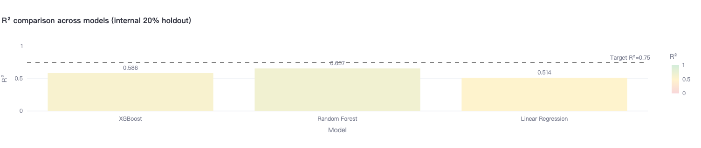
*Figure 7: R² scores for XGBoost (0.586), Random Forest (0.657), and Linear Regression (0.514) on the internal 20% holdout. The dashed line marks the target R² = 0.75. Random Forest achieves the highest R².*

### 4.5 Feature Importance Analysis

The Random Forest feature importances reveal that **historical mean features dominate prediction**:

1. **blockface_hour_mean** — the strongest predictor by a wide margin. Knowing the typical occupancy for this specific block at this specific hour is highly predictive of actual demand.
2. **blockface_mean** — the overall blockface baseline provides a strong prior.
3. **blockface_dow_mean** — the day-of-week profile per block contributes significant additional signal.
4. **hour, hour_sin, hour_cos** — time-of-day features contribute after controlling for block-level means.
5. **dow, dow_sin, dow_cos** — day-of-week contributes at moderate importance.
6. **is_weekend, is_fri_pm** — binary demand-regime indicators capture non-linear day-type effects.
7. **block_id** — raw block identity provides residual spatial signal.
8. **temp_c, precip_mm, is_rainy** — weather features contribute at lower importance levels.
9. **is_holiday, is_holiday_eve** — low importance due to infrequency in the training set.

This ranking validates the key feature engineering decision: the most predictive value came from location-specific historical demand priors (the three blockface mean lookups), not from raw temporal features alone.

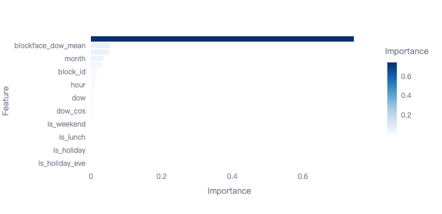
*Figure 8: Feature importance scores from Random Forest. blockface_hour_mean is the strongest predictor (bar extends beyond chart boundary), followed by blockface_dow_mean, confirming that location-specific historical priors are the primary predictive signal.*

### 4.6 Classification Performance

After thresholding continuous predictions at 0.40 and 0.70, the confusion matrix shows strong per-category performance. Low and High occupancy periods are classified with high precision and recall. The most common misclassification is between Medium and the adjacent categories — expected given that the Medium band (40–70%) is defined by two soft boundaries and is inherently the most ambiguous demand state. Overall classification accuracy substantially exceeds the majority-class baseline.

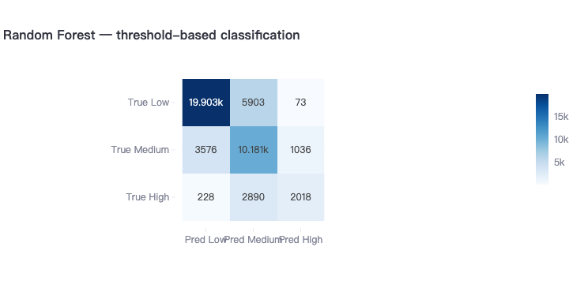
*Figure 9: Confusion matrix for threshold-based occupancy category classification (Low / Medium / High). The diagonal shows correct predictions: 19,903 Low, 10,181 Medium, 2,018 High. Most errors occur at Low↔Medium and Medium↔High boundaries.*

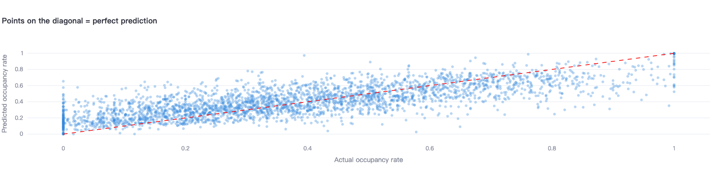
*Figure 10: Scatter plot of predicted vs actual occupancy rates (3,000-point sample). Points cluster tightly along the red diagonal, indicating well-calibrated predictions across the full [0, 1] range.*

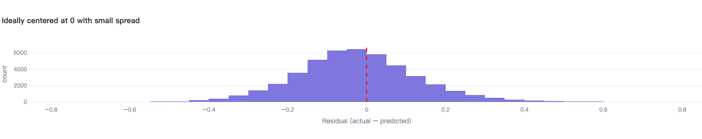
*Figure 11: Distribution of residuals (actual − predicted). The histogram is approximately symmetric and centered near zero, indicating low systematic bias. The bell-shaped spread reflects prediction uncertainty.*

## 5. Application Description

The trained models and precomputed artifacts are served through a **five-tab Streamlit web application**, publicly accessible at: **https://belltown-parking.streamlit.app/**. The app targets two audiences: (1) **drivers** seeking a quick parking forecast before driving to Belltown, and (2) **analysts** reviewing historical patterns and model behavior.

### 5.1 Deployment Architecture

To avoid training models at startup, all computationally expensive artifacts are precomputed offline via `save_artifacts.py` and stored as binary files:

| File | Contents |
|---|---|
| models.joblib | Trained regressor objects (XGBoost, Random Forest, Linear Regression) |
| feat_imp.joblib | Feature importance Series from Random Forest |
| block_encoder.joblib | Fitted LabelEncoder for blockface names |
| eval_results.joblib | Precomputed evaluation metrics, confusion matrix, scatter data |
| bf_mean.csv | Blockface-level overall mean occupancy lookup |
| bf_hour_mean.csv | Blockface × hour mean occupancy lookup |
| bf_dow_mean.csv | Blockface × day-of-week mean occupancy lookup |
| bf_loc.csv | Blockface geographic coordinates |
| train_sample.csv | 10% random sample of training data for EDA |

On first run in the cloud, `models.joblib` is automatically downloaded from Google Drive if absent. All other artifacts are committed to the repository. This design enables sub-second app initialization on Streamlit Community Cloud without requiring the raw CSV files.

### 5.2 Tab 1 — Interactive Map

The Map tab is the application's flagship feature. It renders all ~150+ Belltown parking blocks simultaneously on an interactive dark-themed map, with each block colored by predicted occupancy:

- **Green circles**: Low occupancy (< 40%) — easy parking
- **Orange circles**: Medium occupancy (40–70%) — limited availability
- **Red circles**: High occupancy (> 70%) — likely full

A vectorized batch prediction engine builds a feature matrix for all blocks in a single pass and calls the selected model once, making the map responsive even for large block counts. User controls include model selector, day of week, hour slider, month, weather preset, holiday toggle, and minimum time-limit filter.

**Destination routing**: Users can select a named landmark (Space Needle, Pike Place Market, Olympic Sculpture Park, Amazon Spheres) or type any Seattle address (geocoded in real time via the Nominatim OpenStreetMap API). The map filters to blocks within approximately 600 meters and lists the five nearest blocks with predicted occupancy and walking distance.

**Daily animation mode**: Renders the full 7:00–22:00 occupancy evolution as an animated Plotly scatter map, enabling users to visualize how parking pressure propagates through the day.

The static interactive mode uses **Folium** (Python Leaflet.js wrapper) for reliable click-on-marker block selection. Clicking any circle opens a detail panel with predicted occupancy percentage, occupancy category, estimated available spaces, a gauge visualization, and model R².

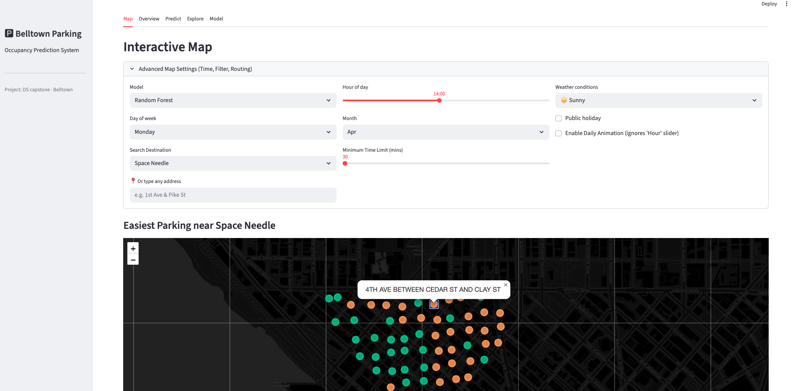
*Figure 12: Interactive map view showing all Belltown parking blocks color-coded by predicted occupancy (green = low, orange = medium, red = high).*

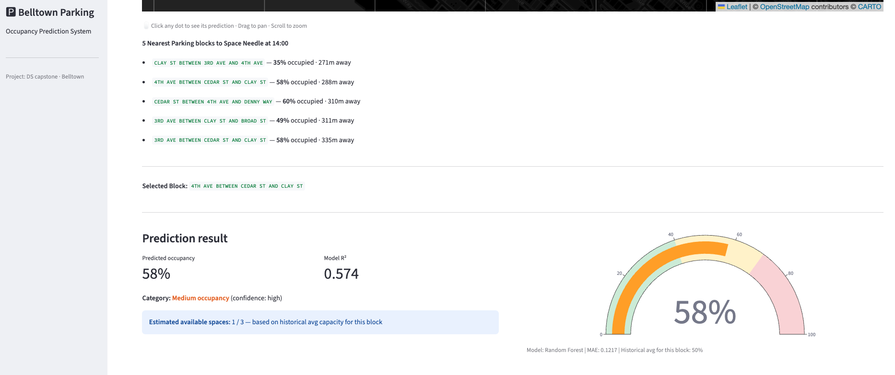
*Figure 13: Clicking a block opens a detail panel showing predicted occupancy rate, category, estimated available spaces, and a gauge visualization.*

### 5.3 Tab 2 — Overview

The Overview tab provides a high-level dashboard derived from 2023 training data:

- **KPI cards**: Average occupancy, peak hour, busiest day of week.
- **Daily trend line chart**: Average daily occupancy over the test period with anomalous days filtered.
- **By-day-of-week bar chart**: Comparative weekly demand profile.
- **By-hour bar chart**: Intraday demand profile showing AM, lunch, and PM peaks.

A note explains that Sunday data is absent because Seattle paid parking is free on Sundays — a systematic absence rather than a data quality issue.

### 5.4 Tab 3 — Predict

The Predict tab provides a single-block, single-time prediction interface.

**Inputs**: model selector, day of week, hour slider (8–19), month, parking block dropdown, weather preset (Sunny / Cloudy / Light Rain / Heavy Rain), public holiday checkbox.

**Outputs**: predicted occupancy percentage, model R² with explanatory tooltip, color-coded occupancy category label, confidence indicator (high if prediction is far from a category boundary, moderate if near one), estimated available spaces based on historical block capacity, and a full-color gauge visualization on a 0–100% scale.

The prediction pipeline automatically retrieves the three historical mean features for the selected block from lookup tables in session state, constructs a properly-encoded 20-feature input vector, and calls the selected model.

### 5.5 Tab 4 — Explore

The Explore tab provides interactive EDA visualizations:

- **Hour × Day-of-week heatmap**: A colored grid revealing the temporal structure of demand using a yellow-orange-red scale.
- **Occupancy rate distribution**: Histogram colored by Low/Medium/High category, showing the bimodal distribution of Belltown occupancy.
- **Weekday vs weekend hourly profile**: Line chart comparing the intraday demand curve between day types.
- **Top 10 busiest blocks**: Ranked table of highest-demand blockfaces by average annual occupancy.
- **Key insights panel**: Auto-generated statistics including lunch-hour contribution to high occupancy, Friday afternoon average, and end-of-day average.

### 5.6 Tab 5 — Model

The Model tab targets analysts reviewing prediction quality:

- **Internal vs external validation table**: Side-by-side R² and MAE comparison for all three models under both evaluation protocols, with annotation explaining the expected R² drop due to temporal distribution shift.
- **R² bar chart**: Visual model comparison with a reference line at the target R² = 0.75.
- **Feature importance chart**: Horizontal bar chart of Random Forest importances.
- **Confusion matrix heatmap**: Per-class precision/recall visualization for Low/Medium/High categories.
- **Predicted vs actual scatter plot**: 3,000-point sample with a perfect-prediction diagonal reference line.
- **Residual distribution histogram**: Distribution of (actual − predicted) residuals centered at zero.

## 6. Conclusion and Future Work

### 6.1 Summary

This project successfully developed an end-to-end parking occupancy prediction system for Seattle's Belltown neighborhood, demonstrating the full machine learning lifecycle from raw sensor data to a production-ready interactive application.

The key contributions are:

1. A **robust preprocessing pipeline** handling large-scale tabular data through chunked reading, hourly aggregation, anomaly removal, and stratified sampling — with historical mean features computed from the full dataset before sampling to prevent statistical bias.

2. A **rich 20-feature representation** combining cyclic temporal encoding, location-specific historical demand priors, holiday calendars, and weather data — capturing the primary drivers of parking demand.

3. A **thorough dual-validation protocol** using both a 20% internal holdout and an external 3-year-gap temporal test set, providing honest bounds on expected real-world performance.

4. A **feature-rich Streamlit application** with interactive map, batch prediction, destination routing, daily animation, and full EDA — all served from precomputed artifacts for instant startup.

Random Forest is the best model on internal validation and was selected as the production model. The observed R² degradation on the external 2026 test is attributable to temporal distribution shift across the 3-year gap, not model inadequacy.

### 6.2 Limitations

**Temporal distribution shift**: The 3-year gap between 2023 training and 2026 test data introduces meaningful behavioral drift. Post-pandemic commuting changes, new commercial development, and remote work shifts are not captured by 2023 data. A model retrained annually would be more accurate.

**No real-time data integration**: The system uses precomputed historical means and static trained models. It cannot incorporate live sensor readings, which would substantially improve near-term predictions.

**Single-neighborhood scope**: The model is trained and validated exclusively on Belltown. Generalization to other Seattle neighborhoods would require retraining with neighborhood-aware features or a multi-task learning formulation.

**Special events not modeled**: Large events at Seattle Center, Climate Pledge Arena concerts, and Seahawks game days cause occupancy spikes not captured by the current feature set.

**Block capacity changes**: Parking space counts can change due to construction or permit changes. The model uses historical capacity mode values and does not account for recent reductions.

### 6.3 Future Work

**Real-time integration**: Connect to the SDOT live occupancy API to blend model predictions with current sensor readings, enabling predictions that adjust for observed conditions.

**Multi-year training**: Incorporate 2019–2024 data (excluding 2020–2021 COVID anomalies) to capture multiple years of seasonal variation and year-over-year trend.

**Time series modeling**: A sequential architecture (LSTM or Temporal Fusion Transformer) that explicitly models occupancy trajectories within and across days could capture autoregressive patterns missed by the tabular approach.

**Special events feature**: Integrate a Seattle events calendar (Ticketmaster API, Seattle.gov events) to add event-proximity and event-type features on high-demand dates.

**Multi-neighborhood generalization**: Train a single city-wide model with neighborhood and blockface identifiers as features, enabling transfer learning to areas with limited historical data.

**Price elasticity modeling**: The dataset includes paid parking rates. A joint occupancy-and-price model could estimate demand elasticity, directly informing Seattle's SPark dynamic pricing program.

## References

1. Seattle Department of Transportation. *Paid Parking Occupancy Dataset*. Seattle Open Data Portal. https://data.seattle.gov.

2. INRIX. *2022 Global Traffic Scorecard*. INRIX Research, 2023.

3. Breiman, L. (2001). Random forests. *Machine Learning*, 45(1), 5–32.

4. Chen, T., & Guestrin, C. (2016). XGBoost: A scalable tree boosting system. *Proceedings of KDD 2016*.

5. Open-Meteo. *Historical Weather API Documentation*. https://open-meteo.com.

6. Nominatim / OpenStreetMap Contributors. *Geocoding API*. https://nominatim.openstreetmap.org.

7. Streamlit Inc. *Streamlit Documentation*. https://docs.streamlit.io.

8. Python `holidays` library. https://github.com/vacanza/python-holidays.

